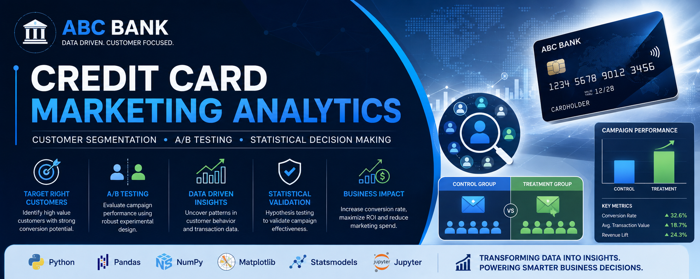
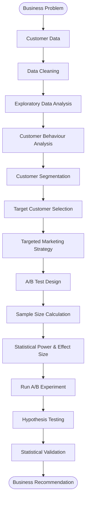
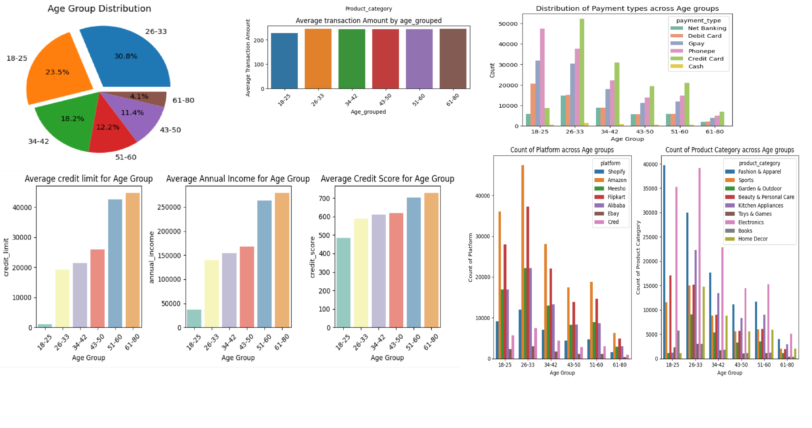

<div align="center">

# 💳 ABC Bank Credit Card Marketing Analytics

### **Customer Segmentation • Marketing Analytics • A/B Testing • Statistical Decision Making**



<br>


**An end-to-end Banking Marketing Analytics project that leverages customer segmentation and statistical experimentation to optimize credit card marketing campaigns and support data-driven business decisions.**

</div>

---

# 📖 Table of Contents

* [Project Overview](#-project-overview)
* [Business Problem](#-business-problem)
* [Business Objectives](#-business-objectives)
* [Business Value](#-business-value)
* [Project Workflow](#-project-workflow)
* [Dataset Overview](#-dataset-overview)
* [Phase 1: Customer Analytics & Segmentation](#-phase-1--customer-analytics--segmentation)
* [Phase 2: A/B Testing & Statistical Validation](#-phase-2--ab-testing--statistical-validation)
* [Technology Stack](#-technology-stack)
* [Repository Structure](#-repository-structure)
* [Key Skills Demonstrated](#-key-skills-demonstrated)
* [Future Improvements](#-future-improvements)
* [Author](#-author)

---

# 📌 Project Overview

Marketing a new credit card to every customer is expensive and often results in poor conversion rates. Instead of adopting a mass marketing strategy, organizations increasingly rely on data analytics to identify customers who are more likely to respond positively to promotional campaigns.

This project demonstrates how customer analytics and statistical experimentation can be combined to support marketing decisions in the banking industry.

The project consists of two integrated analytical phases:

### **Phase 1 — Customer Analytics & Segmentation**

Customer demographic, transaction, and credit profile data were analyzed to understand customer behavior and identify high-value customer segments for a new credit card campaign.

### **Phase 2 — A/B Testing & Statistical Validation**

A statistically designed A/B test was used to evaluate whether the proposed marketing campaign produced a significant improvement before recommending a full-scale rollout.

Together, these phases demonstrate an end-to-end analytics workflow that transforms raw customer data into actionable business recommendations.

---

# 🎯 Business Problem

ABC Bank planned to launch a new credit card but wanted to avoid spending its marketing budget on customers who were unlikely to respond.

The bank needed to answer two critical business questions:

1. **Which customers should be targeted for the new credit card campaign?**
2. **Should the proposed marketing campaign be launched to all customers?**

The objective was to improve campaign effectiveness while reducing unnecessary marketing expenditure through data-driven decision making.

---

# 🎯 Business Objectives

* Analyze customer demographics and financial behavior.
* Identify a strategic customer segment for the campaign.
* Understand spending patterns across customer groups.
* Design and evaluate an A/B experiment.
* Determine whether the campaign produces a statistically significant improvement.
* Provide an evidence-based business recommendation.

---

# 💼 Business Value

| Business Challenge             | Analytics Solution                                                           |
| ------------------------------ | ---------------------------------------------------------------------------- |
| Low campaign conversion        | Identify high-value customer segments                                        |
| High acquisition cost          | Target only customers with higher conversion potential                       |
| Uncertain campaign performance | Validate marketing strategy using A/B Testing                                |
| Business decision risk         | Support rollout decisions with statistical evidence                          |
| Limited customer insights      | Analyze customer demographics, spending patterns, and credit characteristics |

---

# 🏗 Project Workflow



---

# 📂 Dataset Overview

The analysis integrates multiple datasets to build a comprehensive understanding of customer behavior.

| Dataset                             | Records | Features | Purpose                    |
| ----------------------------------- | ------: | -------: | -------------------------- |
| customers.csv                       |   1,000 |        8 | Customer demographics      |
| transactions.csv                    | 500,000 |        7 | Customer purchase history  |
| credit_profiles.csv                 |   1,004 |        6 | Credit profile information |
| avg_transactions_after_campaign.csv |      62 |        3 | Campaign performance       |


The combination of these datasets enables customer profiling from demographic, financial, and behavioural perspectives.

---

# 📊 Phase 1 — Customer Analytics & Segmentation

## 🔹 Data Preparation

The first phase begins with preparing customer data for analysis.

Activities performed include:

* Data import and inspection
* Missing value identification
* Missing value treatment
* Occupation-wise median imputation for Annual Income
* Data quality validation

Using occupation-wise median income helps preserve realistic income distributions while reducing the influence of outliers.

---

## 🔹 Exploratory Data Analysis (EDA)

Comprehensive exploratory analysis was performed to understand customer behaviour and identify meaningful business insights.

The analysis includes:

* Customer demographics
* Age distribution
* Income analysis
* Occupation analysis
* Credit score distribution
* Credit limit analysis
* Transaction amount analysis
* Payment behaviour
* Customer spending patterns

Multiple visualizations were created using Matplotlib to support business interpretation.

---

## 🔹 Customer Behaviour Analysis

Customer behaviour was analyzed from multiple dimensions including:

* Spending habits
* Credit characteristics
* Income distribution
* Transaction frequency
* Payment preferences

The analysis provides a deeper understanding of customer purchasing behaviour and financial profiles.

---

## 🔹 Customer Segmentation

Based on customer demographics, spending behaviour, and credit characteristics, high-value customer segments were identified.

The objective was to prioritize customers who are more likely to respond positively to the new credit card offering.

This targeted approach improves campaign efficiency while reducing unnecessary marketing costs.

---

## 📌 Phase 1 Outcome

The customer analytics phase helps answer:

> **Who should receive the new credit card campaign?**

Rather than targeting every customer, marketing resources can be directed toward customer segments with greater conversion potential.

---

# 🎯 Target Customer Selection

The exploratory analysis identified **customers aged 18–25 years** as a strategic target segment for the proposed credit card campaign. Although this group currently exhibits lower income levels, limited credit history, and lower credit card adoption, it represents approximately **26% of the bank's customer base**, making it an attractive opportunity for long-term customer acquisition.

Instead of targeting customers solely based on current spending behavior, the campaign focuses on engaging young adults at an early stage of their financial journey to encourage credit card adoption and build long-term customer relationships.

### Key Insights Supporting Target Selection

- 📊 Represents approximately **26%** of the total customer base.
- 💰 Average annual income is **below ₹50,000**.
- 📉 Lower credit scores and credit limits due to limited credit history.
- 💳 Lower credit card usage compared to older age groups.
- 🛍️ Most purchased categories:
  - Electronics
  - Fashion & Apparel
  - Beauty & Personal Care
- 💸 Lower average credit card transaction value.

### Business Rationale

Although this segment currently generates lower credit card revenue, its large population and early stage in the financial lifecycle make it an **untapped market**. Launching a targeted marketing campaign for this group provides the opportunity to increase credit card adoption, establish early customer relationships, and improve long-term customer lifetime value.

# 🧪 Phase 2 — A/B Testing & Statistical Validation

After identifying target customers, a statistically designed A/B experiment was conducted to evaluate campaign effectiveness.

---

## 🔹 Experimental Design

Customers were randomly divided into two groups:

### Control Group

Received the existing marketing campaign.

### Treatment Group

Received the proposed marketing campaign.

The objective was to compare campaign performance under controlled conditions.

---

## 🔹 Statistical Planning

Before launching the experiment, the following statistical parameters were determined:

* Significance Level (α)
* Statistical Power
* Effect Size
* Required Sample Size

This planning ensures that the experiment is sufficiently powered to detect meaningful improvements.

---

## 🔹 Hypothesis Testing

### Null Hypothesis (H₀)

The new campaign does not improve customer transaction behaviour.

### Alternative Hypothesis (H₁)

The new campaign significantly improves customer transaction behaviour.

The hypothesis was evaluated using statistical testing implemented in Python.

---

## 🔹 Statistical Concepts Applied

* A/B Testing
* Hypothesis Testing
* Statistical Power
* Effect Size
* Sample Size Calculation
* p-value Interpretation
* Two-SSample Statistical Testing

---

## 📌 Phase 2 Outcome

The statistical analysis determines whether the observed improvement is statistically significant or simply due to random sampling variation.

The final recommendation is based on statistical evidence rather than assumptions.

---

# 📈 Project Deliverables

* Customer Segmentation Strategy
* Business Insights from EDA
* Marketing Campaign Evaluation
* Statistical Validation
* Business Recommendation
* Data-Driven Decision Support

---

# 🛠 Technology Stack

### Programming

* Python

### Libraries

* Pandas
* NumPy
* Matplotlib
* Statsmodels
* Jupyter Notebook

### Statistical Techniques

* Exploratory Data Analysis
* Customer Segmentation
* A/B Testing
* Hypothesis Testing
* Sample Size Calculation
* Statistical Power
* Effect Size
* Statistical Significance Testing

---

# 📁 Repository Structure

```text
📂 credit-card-marketing-analytics

│
├── 📓 ABC_Credit_card_launch_phase1.ipynb
│
├── 📓 ABC_credit_card_launch_phase2.ipynb
│
├── 📂 visuals
│   ├── banner.png
│   ├── Age_group_distribution.png
│   ├── bar_plot_Annual_Income.png
│   ├── transaction_amount_distribution.png
│   ├── payment_type_distribution.png
│   ├── payment_type_distribution_across_age_group.png
│   ├── average_income_by_category.png
│   ├── Avg_trans_amount.png
│   ├── Scatter_plot_credit_score_and_credit_limit.png
│   ├── scatterplot_annual_income_and_credit_score.png
│   ├── Correlation_matrix.png
│   ├── Distribution_of_control_test_group.png
│   └── Distribution_of_platform_within_each_product_category.png 
│
├── 📄 README.md
│
└── requirements.txt
```

---

# 📊 Key Skills Demonstrated

| Business Analytics          | Statistics              | Programming      |
| --------------------------- | ----------------------- | ---------------- |
| Banking Analytics           | Hypothesis Testing      | Python           |
| Customer Segmentation       | A/B Testing             | Pandas           |
| Marketing Analytics         | Statistical Power       | NumPy            |
| Business Intelligence       | Effect Size             | Matplotlib       |
| Customer Behaviour Analysis | Sample Size Calculation | Statsmodels      |
| Data Visualization          | Statistical Testing     | Jupyter Notebook |

---

# 🚀 Future Improvements

* Predictive customer targeting using Machine Learning
* Customer Lifetime Value (CLV) prediction
* Uplift Modeling for personalized marketing
* Interactive Power BI Dashboard
* Campaign Performance Dashboard
* Automated Marketing Recommendation System

---

# 📸 Project Screenshots

# 📊 Exploratory Data Analysis

The following dashboard summarizes the key exploratory analysis performed on customer demographics, spending behaviour, credit profile, payment preferences, and product interests.

<p align="center">
    
</p>

### Key Business Insights

- 🎯 Customers aged **18–25** represent approximately **23.5%** of the customer base and were identified as a strategic growth segment.
- 💰 This segment has the **lowest average annual income**, reflecting customers in the early stages of their careers.
- 💳 They also have **lower credit scores and credit limits**, indicating limited credit history.
- 📈 Average transaction amounts are lower than older age groups, suggesting opportunities to increase engagement.
- 🛍️ Electronics, Fashion & Apparel, and Beauty & Personal Care are the most popular product categories.
- 💡 These findings supported selecting the **18–25 age group** for the targeted marketing campaign evaluated through A/B testing.

---

# 🎓 Key Learning Outcomes

Through this project, I gained practical experience in:

* Customer Analytics
* Marketing Analytics
* Banking Data Analysis
* Statistical Experiment Design
* A/B Testing
* Business Decision Making
* Data Visualization
* Statistical Analysis using Python

---

# 👩‍💻 Author

## **Bharti Kumari**

**Aspiring Data Scientist | Banking Analytics | Business Analytics | Python | SQL | Power BI | Statistics**

Passionate about solving business problems through data analytics, statistical thinking, and data-driven decision making.

⭐ **If you found this project interesting, consider giving it a star!**

